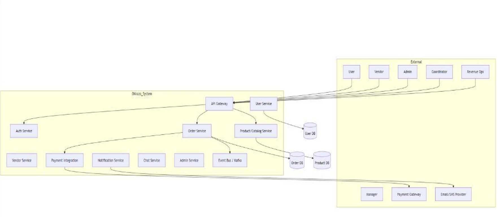

# 🏗️ System Architecture

## Overview

Okkazo is designed as a **distributed event management platform** following the **Microservices Architecture** pattern. Instead of building a single monolithic application, the system is divided into multiple independently deployable services, each responsible for a specific business capability.

This architecture enables better scalability, maintainability, fault isolation, and collaborative development by allowing services to evolve independently.

---

# Architecture Diagram



---

# High-Level Architecture

```text
                    React Web Application
                             │
                             │ HTTP/HTTPS
                             ▼
                 Spring Boot API Gateway
                             │
                             ▼
                 Eureka Service Discovery
                             │
 ───────────────────────────────────────────────────────
 │        │        │        │        │        │
 ▼        ▼        ▼        ▼        ▼        ▼
Auth    User    Event   Vendor   Order   Admin
 │        │        │        │        │        │
 └────────┴────────┴────────┴────────┴────────┘
                    │
         Email • Notification • Chat
                    │
             MySQL / MongoDB
```

---

# Architectural Principles

The project follows several core architectural principles:

- Separation of Concerns
- Single Responsibility per Service
- Independent Deployment
- Loose Coupling
- High Cohesion
- Stateless Service Design
- API-Driven Communication
- Modular Development

---

# Components

## Client Applications

The platform consists of multiple client applications that consume backend APIs.

- React Web Application
- Mobile Application

Both communicate exclusively through the API Gateway.

---

## API Gateway

The API Gateway acts as the single entry point for all incoming client requests.

Responsibilities include:

- Request Routing
- Authentication Validation
- Request Forwarding
- Centralized API Access
- Gateway-Level Configuration

---

## Eureka Server

Eureka provides service discovery for backend microservices.

Instead of using hardcoded service addresses, services register themselves with Eureka and discover other services dynamically.

Benefits include:

- Dynamic Service Registration
- Service Discovery
- Simplified Scaling
- Reduced Configuration Overhead

---

## Authentication Service

Responsible for:

- User Authentication
- User Registration
- Login
- JWT Token Generation
- Authorization Support

---

## Business Services

Business logic is distributed across multiple independent services.

Current services include:

- User Service
- Event Service
- Vendor Service
- Order Service
- Admin Service
- Email Service
- Notification Service
- Chat Service

Each service owns its own domain logic and communicates through REST APIs.

---

# Request Lifecycle

A typical request follows this flow:

1. Client sends request.
2. API Gateway receives the request.
3. Gateway validates and routes the request.
4. Eureka resolves the target service.
5. Target microservice processes the request.
6. Database operations are performed.
7. Response is returned through the Gateway.
8. Client receives the response.

---

# Advantages of the Architecture

The chosen architecture provides several benefits:

- Independent service development
- Easier maintenance
- Better scalability
- Improved fault isolation
- Faster feature development
- Technology flexibility
- Team collaboration
- Simplified deployment

---

# Technology Choices

| Component | Technology |
|----------|------------|
| Frontend | React |
| API Gateway | Spring Boot |
| Service Discovery | Eureka Server |
| Authentication | Spring Boot |
| Business Services | Node.js |
| Database | MongoDB / MySQL |
| Containerization | Docker |

---

# Future Enhancements

Potential architectural improvements include:

- Distributed Caching
- Message Queue Integration
- Centralized Logging
- Distributed Tracing
- Monitoring & Metrics
- Circuit Breaker Pattern
- API Rate Limiting
- Cloud Deployment

---

# Related Documentation

- [Microservices](microservices.md)
- [Deployment](deployment.md)
- [Security](security.md)
- [Project Structure](project-structure.md)
